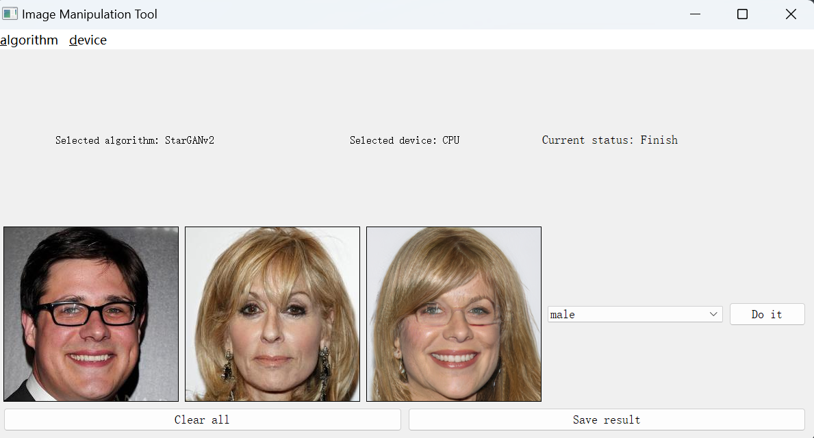
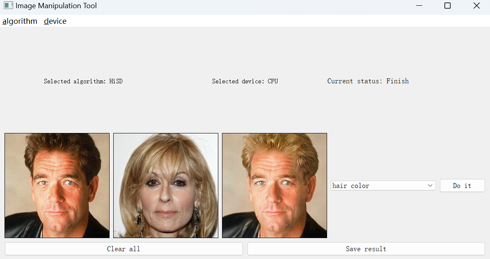
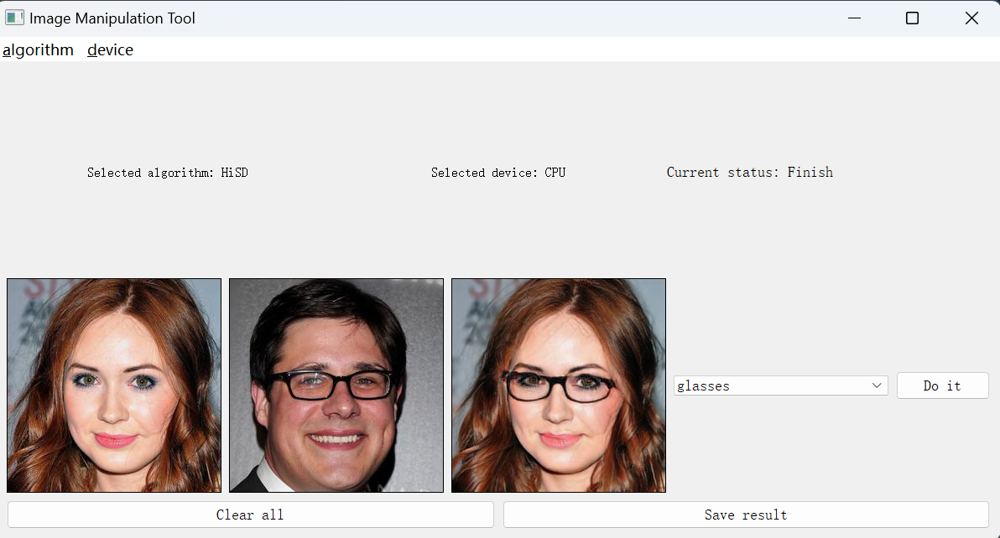
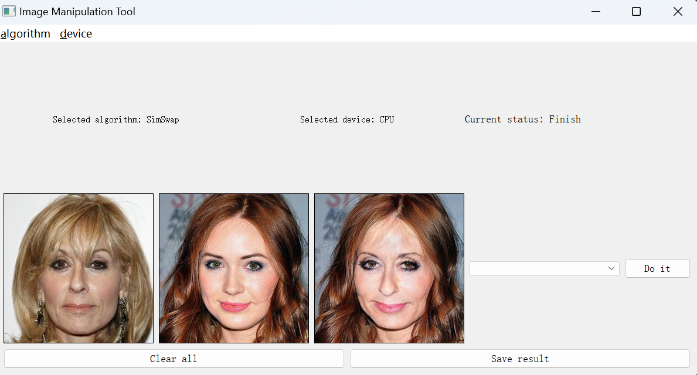

### preparation

##### Environment

Creating a `conda` environment named `pytorch`：

```
conda create -n pytorch python=3.7
```

Install the required dependency packages. Given in `requirements.txt.`

##### Pretrained models

`StarGANv2`: 

https://github.com/clovaai/stargan-v2

```
bash download.sh celeba-hq-dataset
bash download.sh pretrained-network-celeba-hq
bash download.sh wing
```

`HiSD`: 

https://github.com/imlixinyang/HiSD.  Put it in `Free_manipulation_system\HiSD\checkpoints`

`HFGI`:

https://github.com/Tengfei-Wang/HFGI. Put it in `Free_manipulation_system\HFGI\checkpoint`

`SimSwap:`

The pretrained model of `SimSwap` and `Arcface` is available in https://github.com/neuralchen/SimSwap. Put them in `DF-RAP/SimSwap/arcface_model/`  and  `DF-RAP/SimSwap/checkpoints/` .


### Usage

running `run.bat`.

`StarGANv2`: 




`HiSD`: 







`SimSwap:`




If you need to call it in your script, you can use the following：

```python
from manipulation import manipulate
manipulate(original_path, algorithm, dev, reference_path, reference)
```

### Acknowledgements
https://github.com/clovaai/stargan-v2

https://github.com/imlixinyang/HiSD

https://github.com/Tengfei-Wang/HFGI

https://github.com/neuralchen/SimSwap

